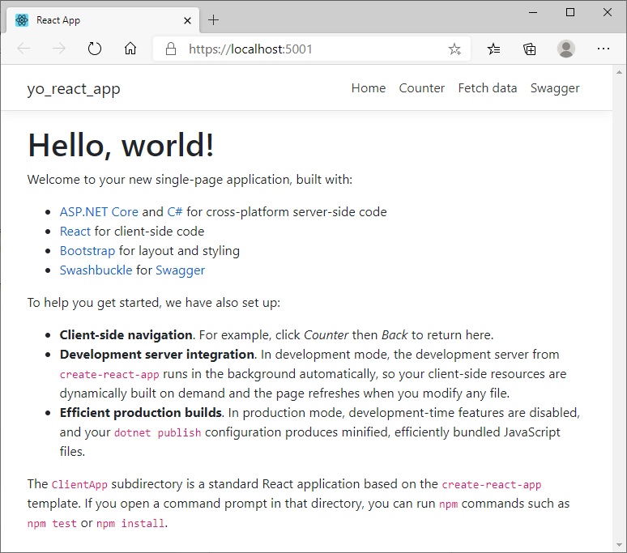

Template project for C# and React
=================================

This project was created using **dotnet new react** and separately **create-react-app --use-npm**.

Contins example client app based on original one from *ASP.NET Core with React.js* template using modern react syntax.

Backend
-------

Main application is written in C# and can be run with ``dotnet`` command. 

### Build ###

```
dotnet build src
```

```
Microsoft (R) Build Engine version 16.6.0+5ff7b0c9e for .NET Core
Copyright (C) Microsoft Corporation. All rights reserved.

  Determining projects to restore...
  All projects are up-to-date for restore.
  YoReactApp -> C:\PROJECT\yo-react-app\src\YoReactApp\bin\Debug\netcoreapp3.1\YoReactApp.dll
  YoReactApp -> C:\PROJECT\yo-react-app\src\YoReactApp\bin\Debug\netcoreapp3.1\YoReactApp.Views.dll
```

### Run ###

```
dotnet C:\PROJECT\yo-react-app\src\YoReactApp\bin\Debug\netcoreapp3.1\YoReactApp.dll
```

```
info: Microsoft.Hosting.Lifetime[0]
      Now listening on: http://localhost:5000
info: Microsoft.Hosting.Lifetime[0]
      Now listening on: https://localhost:5001
info: Microsoft.Hosting.Lifetime[0]
      Application started. Press Ctrl+C to shut down.
info: Microsoft.Hosting.Lifetime[0]
      Hosting environment: Production
info: Microsoft.Hosting.Lifetime[0]
      Content root path: C:\PROJECT\yo-react-app
```

Frontend
--------

[ClientApp](src/YoReactApp/ClientApp) contains ``react`` example app using ``react-router`` and ``reactstrap`` libraries.


